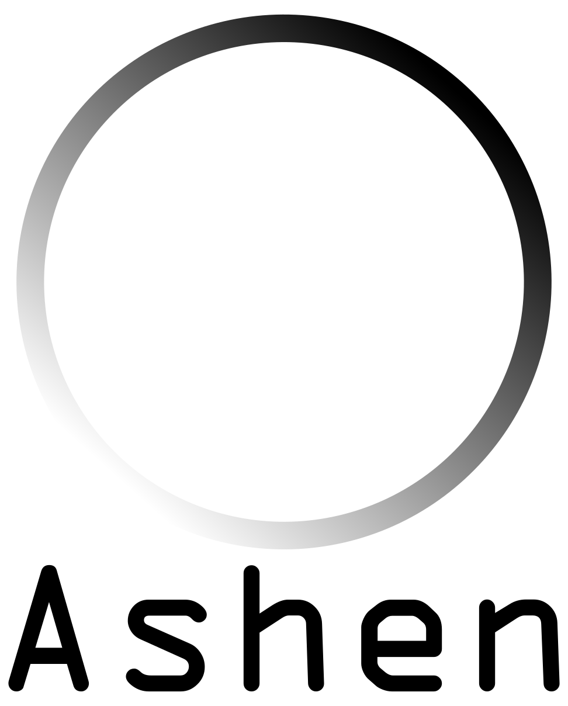

# Ashen

 <p align="center">  </p> 

Ashen is a Python resource designed to extract and work with information from ICRP Publication 107, a comprehensive collection of physical properties of radionuclides. It provides simple access to radionuclide data for use in research, clinical applications, or educational purposes.

This was mostly made as a pet project in accociation with absorbed dose calculation for radionuclide therapy. The goal is to provide a simple interface to access the data in ICRP 107, and to make it easy to use in Python.

This is still under development and contributions are welcome, please make a pull request or open an issue if you have any suggestions or improvements.

## Features

- Access radionuclide physical properties from ICRP 107

- Easy-to-use Python functions

- Demonstration script to get started

- Planned support for:

    - Command-line interface (CLI)

    - Simple graphical user interface (GUI)

## Installation

Clone the repository and install the required dependencies:
```bash
git clone https://github.com/yourusername/ashen.git
cd ashen
pip install -r requirements.txt
```
## Usage

- A simple example script is provided in the demo.py file to demonstrate how to use the functions in Ashen.

Future versions will include:

-     A command-line tool for quick access to data.

-     A lightweight graphical interface for browsing radionuclide properties.

## License

This work make use of the ICRP Publication 107 data. Please refer to the ICRP website for more information on the license and usage of the data.

Ashen is licensed under the MIT License. See the LICENSE file for more information.

